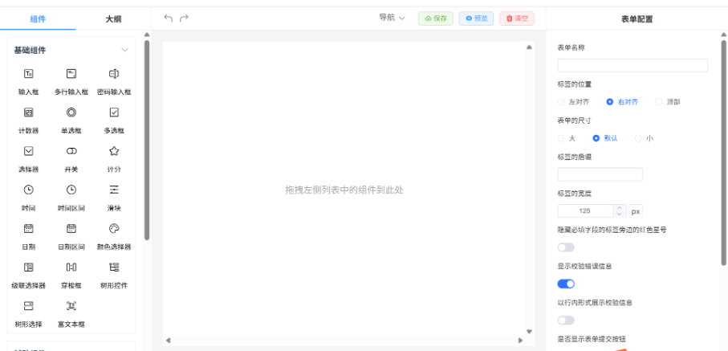

Collector-app

看板有很多表单类的输入，为了提效免后端开发，我调研了一些低代码平台，但目前市面上没有统一的方案可以方便快捷的导入表单类数据。

1	https://form.lljj.me/schema-generator.html#/index
支持数组	布局不灵活
2	https://www.form-create.com/v3/designer/	丰富布局、自定义事件等	不支持数组
3	https://formbuilder.dev/demo/	要收费
4	https://codepen.io/travist/full/xVyMjo/	angular版

最后选用了基于form-create 衍生的版本

collector-app 为低代码的后端，详见 internal/service/form.go